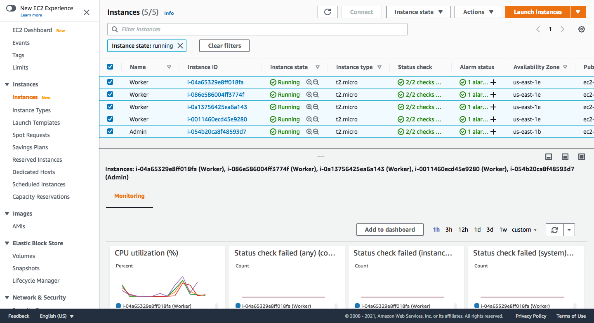

# AWS - Guía

## AWS - Console

Primero iniciaremos creando las instancias. En nuestro caso utilizaremos 6 instancias `t2.micro` (con Ubuntu 20.04 LTS) ya que son las instancias mas accesibles.



### Grupos de Seguridad  (Reglas de FW)

Luego de creadas las 5 instancias configuramos las grupos de seguridad (o reglas de firewall). Para configurarlo facilmente definiremos 2 grupos de seguridad:

#### Grupo Worker

En este grupo necesitamos que expongan los puertos necesarios para que cada VM worker pueda ser parte del Swarm. A continuación detallamos los puertos que deben abrirse.

| Protocolo / Puerto | Applicación | Descripción |
|--|--|--|
|`TCP/2376` | Docker | Utilizados para comunicación segura con el cliente Docker. Es utilizado por Docker Machine para orquestar la comunicación con los hosts Docker.|
| `TCP/7946` `UDP/7946`| Docker | Utilizado para la comunicación entre todos los nodos(container network discovery).|
| `UDP/4789`| Docker | Utilizado por tráfico de red overlay|

#### Grupo Manager

| Protocolo / Puerto | Applicación | Descripción |
|--|--|--|
| `TCP/2377` | Docker | Este puerto es para comunicar los nodos del Swarm. Solo es necesario que este abierto en los Nodos Managers.|
| `TCP/5672` | RabbitMQ | Puerto principal de RabbitMQ (Publicación, Consumo  de mensajes, etc) |
| `TCP/15672` | RabbitMQ | Interfaz de administración web|
| `TCP/15674` | RabbitMQ | Websockets |

#### Grupo Web

| Protocolo / Puerto | Applicación | Descripción |
|--|--|--|
| `TCP/8080` | VueJS FrontEnd | UI Web (VueJS) |
| `TCP/5000` | Flask Backend | Tiles Server |

> Nota: Todos los puertos definidos anteriormente hacen referencia a tráfico de ingreso (Ingress Traffic). Para el tráfico de egreso no lo limitaremos.

#### Source IP

Para todos los nodos del `grupo worker` definimos la source IP como todos aquellos que pertenezcan al `grupo worker` y al `grupo manager`.

Para el `grupo manager`, RabbitMQ y Docker solo a las máquinas del `grupo worker`

Para el `grupo web`, VueJS y Flask los dejamos accesibles a Internet.

---

## Configurando las instancias

En la siguiente sección describiremos como fueron configuradas las maquinas virtuales. Haremos hincapié en el Work Stack, que es el conjunto de aplicaciones centrales de Geo-Diff. Los commandos descriptos a continuación deben ejecutarse en todas las VMs salvo los casos especificados.

### Getting Resources & Dependencies

SSH en `<nombre-instancia>` con el certificado `<ssh.pem>`. 

```bash
ssh -i <ssh.pem> ubuntu@<nombre-instancia>
```

>Nota: Al momento de crear la instacia un certificado le fue entregado por AWS, por favor descargue el mismo que será utilizado durante todo este proceso.

Ejemplo:

```bash
ssh -i "geodiff.pem" ubuntu@ec2-54-173-23-136.compute-1.amazonaws.com
```

Clonar repositorio de github

```bash
git clone https://github.com/mrgrassho/geo-diff-2.git
```

Copiar scripts en el home (`~/`)

```bash
cd ~/
cp -r geo-diff-2/scripts/* .
```

Instalar docker con `scripts/docker_install.sh` (es necesario  instalarlo en todas las instancias)

```bash
sudo ./docker_install.sh
```

### Solo en el manager/admin

Descargar tiles con `scripts/download_tiles.sh`

```bash
sudo ./download_tiles.sh
```

Descomprimir `tiles-full`. Es necesario juntar las partes del .zip primero. Ver [https://unix.stackexchange.com/questions/40480/how-to-unzip-a-multipart-spanned-zip-on-linux](https://unix.stackexchange.com/questions/40480/how-to-unzip-a-multipart-spanned-zip-on-linux)

Crear volumen de docker utilizando el path absoluto (`<PATH-TILES>`) del los tiles descargados.

```bash
docker volume create --driver local \
                    --opt type=none \
                    --opt device=<PATH-TILES> \
                    --opt o=bind tiles-data
```

## Configurando el Swarm

### Manager - Work Stack

SSH en `<nombre-instancia>` con el certificado `<ssh.pem>` en el Nodo Manager

```bash
ssh -i <ssh.pem> ubuntu@<nombre-instancia>
```

Iniciar el swarm

```sh
sudo docker swarm init
```

Obtenemos el join token que nos permitira agregar los worker al enjambre.

```bash
$ docker swarm join-token worker
To add a worker to this swarm, run the following command:

    docker swarm join \
    --token SWMTKN-1-49nj1cmql0jkz5s954yi3oex3nedyz0fb0xx14ie39trti4wxv-8vxv8rssmk743ojnwacrr2e7c \
    192.168.99.100:2377
```

Agregar el label `master`

```bash
docker node update --label-add typeNode=master <manager>
```

### Worker - Work Stack

SSH en `<nombre-instancia>` con el certificado `<ssh.pem>` en los nodos Worker

```bash
ssh -i <ssh.pem> ubuntu@<nombre-instancia>
```

Lo agregamos al Swarm con el token previamente obtenido:

```bash
docker swarm join \
--token SWMTKN-1-49nj1cmql0jkz5s954yi3oex3nedyz0fb0xx14ie39trti4wxv-8vxv8rssmk743ojnwacrr2e7c \
192.168.99.100:2377
```

### Deploy - Work Stack

Como último paso, es necesario configurar el archivo `docker-compose-work-aws.yml` con la cantidad de workers. Para conocer los parametros optimos dirigirse a los análisis de carga executados. Una vez configurado los parametros de la work stack deployar al swarm con el siguiente comando.

```bash
./set_up_stack.sh docker-compose-work-aws.yml geo-diff-work-aws
```

> Nota: Los límites de CPU y Memoria definidos en `docker-compose-work-aws.yml` fueron determinados a partir de los recursos disponibles en las instancias `t2.micro` utilizadas y pruebas locales.

### Manager - Web Stack

Para la configuración del Web Stack es muy simple, primero seguir los pasos definidos en en [esta sección](#getting-resources--dependencies).

Ahora iniciamos la configuración, para el primer paso es necesario correr el siguiente comando en el `manager` original, es decir el manager que utilizamos para la work stack.

```bash
$ docker swarm join-token manager
    To add a manager to this swarm, run the following command:

        docker swarm join --token SWMTKN-1-3t9xeavm8olcv3dd44tqdzmuy7b9hcsoacd56iskphoxdxblfs-18a1p3slhdb943vgb9fjc6kcq 192.168.65.3:2377
```

Como se puede ver, Docker ya nos retorna el comando necesario para unirse al Swarm. A continuación corra el comando provisto en máquina `admin-web`.

Luego agregar el label `master-web` a la maquina actual (`<admin-web>`)

```bash
docker node update --label-add typeNode=master-web <admin-web>
```

### Deploy - Web Stack

Como último paso correr el siguiente comando.

```bash
./set_up_stack.sh docker-compose-web-aws.yml geo-diff-web-aws
```

> Nota: Para correr la Web Stack no es necesario que estan encendidas las máquinas Worker pero si es imprescindible que el manager este activo ya que este es el que contiene todos los tiles procesados.

---

## Disponibilidad

Con la configuración actual y los recursos disponibles, ¿Cómo hacemos para aumentar la disponibilidad de la aplicación?

A continuación definimos una serie de propuestas para aumentar la disponibilidad de la aplicación identificando los puntos críticos, debilidades y fortalezas.

### Arquitectura

Como vimos la aplicación está segmentada en 2 grandes grupos, `Web Stack` y `Work Stack` ambas trabajan en conjunto pero no es necesario que esten activas todo el tiempo para mantener la aplicación en funcionamiento.

En el hipotético caso en el que esta aplicación sea llevada a producción, se podría tener activa 24/7 la `Web Stack` ya que provee los resultados a los usuarios (Mapa y la segmentación de superficies), y mantener la `Work Stack` trabajando por turnos o en periodos de tiempo, maximizando asi los recursos disponibles y permitiendo ahorrar créditos en la nube.

#### ¿Qué pasa si un nodo (VM) falla?

Si llegara a fallar un nodo Worker no hay mucho problema porque el manager deployaria los distribuiria los servicios caidos en todos los demas workers si es que tienen disponibilidad.

En caso de que fallase la maquina `manager` en la arquitectura actual, se colapsaria la aplicación. Para evitar esto se puede solucionar de una forma sencilla.

**Solución #1:**

 1. En AWS, crear una instancia `manager backup` con la misma configuración de red y specs que el `manager`
 1. Instalar Docker en la imagen y crear en volumen `tiles-data`
 1. Hacer un BackUP de la carperta tiles en el `manager` y utilizando una herramienta como `crontab`, definir la periodicidad del backup.
 1. Agregar este nodo como manager al swarm.

**Solución #2:**

 1. Evaluar la posibilidad de utilizar un [Volume Plugin](https://docs.docker.com/engine/extend/plugins_volume/) que no haga depender ls tiles de una VM. Tal vez utilizando un servicio como S3.

#### ¿Qué pasa si un geo-diff-worker (script) falla?

En caso de que fallase un script `geo-diff-worker` el `geo-diff-admin_worker` lo detectaria, ya que todo cada cierto tiempo el `geo-diff-worker` notifica su estado en la `KEEP_ALIVE` queue de RabbitMQ

#### ¿Qué pasa si alguno de los scripts (`geo-diff-dealer` o `geo-diff-updater`) fallan?

En caso de los scripts `geo-diff-dealer` o `geo-diff-updater` fallen se reinciaran como es su comportamiento por defecto definido en el `docker-compose`.

#### ¿Qué pasa si el RabbitMQ falla?

Utilizando la configuración actual, estamos en problemas. El servidor de RabbitMQ es de suma importancia ya que es el nexo entre las tareas a procesar y los resultados, además de ser el encargado de notificar el estado de los workers.

**Solución #1:**

Para solventar esta falencia, una posible solución sería implementar un cluster de RabbitMQ, pero para ello necesitariamos agregar mas instancias ya que la disponibilidad actual de las `t2.micro` es poca, además de agregar un servicio de proxy que actue de balanceador entre las instancias de RabbitMQ.
