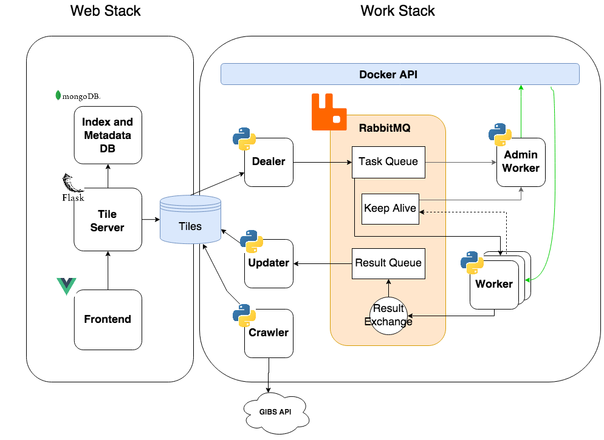

# GeoDiff

Sistema de segmentación de superficies terrestres.

## Demo


## Getting Started

A continuación definiremos las instrucciones para poder tener el proyecto corriendo de manera local. Ve a la sección **Instalación**.

### Prerequisitos

Para la instalación del proyecto es necesario descargar [Docker](https://docs.docker.com/desktop/) y [Docker Compose](https://docs.docker.com/compose/install/)

También es necesario descargar los [TILES](https://app.box.com/s/pakte9wz7u0xfoitmktxsspbz01wsijc), que son las imagenes que conforman el mapa. Se puede omitir esta descarga utilizando los tiles ubicados en `test-data/tiles-mini`

> Tip: El path donde extraigamos los resultados es conveniente asignarlo a una variable de entorno ya que luego lo utilizaremos `export TILES="/home/tiles"`

### Instalación - Docker

A continuación definiremos los pasos para correr el proyecto.

```bash
git clone https://github.com/mrgrassho/geo-diff
```

Una vez instalado docker es necesario activar el `swarm:mode`:

```bash
docker swarm init
```

Crear volumen, este será el medio donde se almacenarán los tiles, para ello utilizar en `device` el path de los TILES que descargamos en la etapa de Prerequisitos. Si asignaste el path a la variable `$TILES` directamente corre el siguiente comando, caso contrario reemplaza `$TILES` por la ubicación de los archivos **es necesario que el PATH sea absoluto**

```bash
docker volume create --driver local \
                    --opt type=none \
                    --opt device=$TILES \
                    --opt o=bind tiles-data
```

> _Nota: Asegurar que el directorio de las imagenes no sea propiedad del usuario `root`. Para ello correr `chwon TU_NOMBRE_USUARIO:TU_NOMBRE_USUARIO $TILES`_

Buildear stack web y deployar a swarm, el script se encuentra en la folder `services`

```bash
./set_up_stack.sh docker-compose-web.yml geo-diff-web  
```

Buildear stack work y deployar a swarm

```bash
./set_up_stack.sh docker-compose-work.yml geo-diff-work  
```

---

## Deploy en AWS

Utilizando los servicios de AWS logramos deployar exitosamente las dos stacks, a partir de ello armamos una guía de como realizamos la configuración de las instancias y grupos de fw. Además discutimos las disponibilidad de la configuración actual y como mejorarla. [VER GUIA AWS](AWS.md)

---

## Documentación

## Arquitectura del Sistema



### Web Stack

| Aplicación     | Función     |
| :------------- | :------------- |
| MongoDB        | Base de Datos no relacional      |
| Mongo-Express  | Administrador de MongoDB  |
| Backend  | Tile Server (Flask) |
| Frontend  | UI Web (VueJS) |

### Work Stack

| Aplicación     | Función     |
| :------------- | :------------- |
| RabbitMQ       | Servidor de Mensajeria   |
| Crawler        | Encargado de descargar los tiles |
| Updater        | Actualiza resultados procesados por los workers   |
| Dealer         | Repartidor de tareas a los workers   |
| Worker         | Procesador de tareas   |
| Admin-Worker  | Administrador de workers, garantiza que estén activos y realiza autoscaling de workers. Este container tiene acceso a la Docker API por la cual puede crear y eliminar workers a demanda |

### Arquitectura de Queues

El servidor de mensajeria tiene 3 queues, las cuales tiene las siguientes funciones:

| Queue     | Función     |
| :------------- | :------------- |
| Task Queue     | Utilizado para alimentar a los workers. Cada worker tomará imagenes a procesar de esta cola |
| Result Queue   | Utilizado para almacenar temporalmente los resultados devueltos por los workers, hasta que el updater consuma el recurso y lo desencole |
| Keep Alive | Esta cola es utilizada por el worker para notificar al admin worker que sigue corriendo |

### Recursos (Imagenes)

La principal materia prima del sistema son los tiles crudos (RAW), que serán las imágenes satelitales en formato [XYZ - Tiled Web Map](https://en.wikipedia.org/wiki/Tiled_web_map) que procesará la work stack.

#### GIBS API

Los recursos son provistos por NASA utilizando la [GIBS API](https://wiki.earthdata.nasa.gov/display/GIBS/GIBS+API+for+Developers#GIBSAPIforDevelopers-GenericXYZTileAccess). Esta API brinda la posibilidad de descargar los recursos en diferentes formatos, en este caso, utilizamos el acceso generico [XYZ - Tiled Web Map](https://en.wikipedia.org/wiki/Tiled_web_map) ya que es lo mas fácil para crawlear en formato JPEG/PNG.

#### Docker Volume

Para comunicar los resultados entre ambas stacks se utiliza un volumen de Docker que sería una abstracción de un File System, esto permite que ambas stacks corran independientemente una de otra.

## Built With

* [RabbitMQ](https://www.rabbitmq.com/) - Message Broker
* [Flask](https://flask.palletsprojects.com/en/1.1.x/) - Micro Web Server in Python
* [MongoDB](https://www.mongodb.com/es) - NoSQL Database
* [VueJS](https://vuejs.org/v2/guide/) - Frontend progressive framework
* [OpenLayers](https://openlayers.org/) - Used for Map render

---

## Análisis de Carga - Work Stack

En el siguiente informe se detalla diferentes pruebas utilizando configuraciones de los parametros que afectan el scaling de la `work stack`. El principal objetivo del mismo es encontrar el número óptimo de Workers para el hardware disponible. En este caso las pruebas fueron realizadas en una Dell XPS (1.6 GHz Dual-Core Intel Core i5, 8 GB 1600 MHz DDR3) con Ubuntu 20.04 LTS, y con los recursos provistos (~1.2GB en tiles). [VER ANÁLISIS](./analysis/workers-performance-comparison.pdf)

---

## License

Este projecto esta bajo MIT License - vea el archivo [LICENSE.md](LICENSE.md) para mas detalles.
