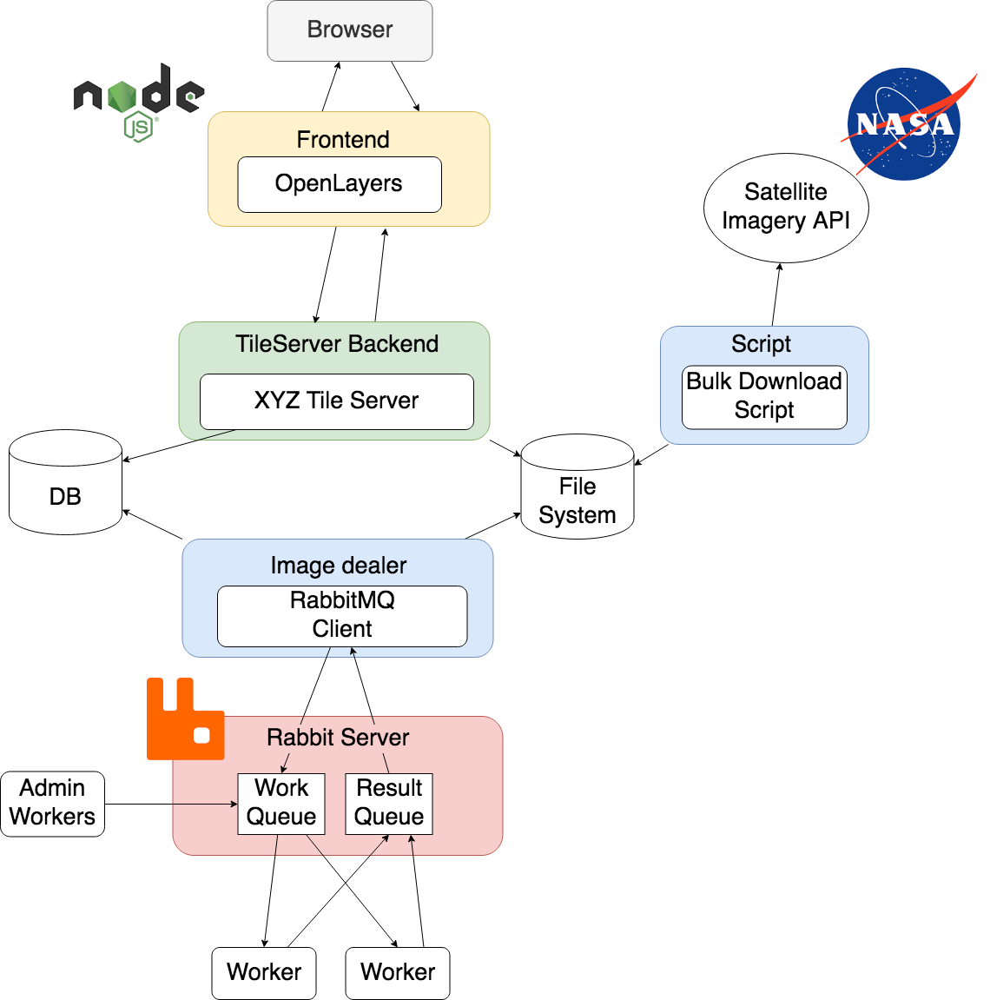

# GeoDiff

Sistema de detección de diferencias sobre superficies terrestres.

## Getting Started

A continuación definiremos las instrucciones para poder tener el proyecto corriendo de manera local. Ve a la sección **Instalación**.

### Prerequisitos

> En desarrollo...

### Instalación

A continuación definiremos los pasos para correr el proyecto.

```
git clone https://github.com/mrgrassho/geo-diff
```

> En desarrollo...

Este último comando instalará las dependecias de los contenedores y los correrá. Para mas información de que hay en los contenedores analice la siguiente tabla:

| Aplicación     | Función     |
| :------------- | :------------- |
| MongoDB        | Base de Datos no relacional      |
| Mongo-Express  | Administrador de MondoDB  |
| RabbitMQ       | Servidor de Mesajeria   |
| Worker         | Procesador de tareas   |
| Admin-Worker  | Administrador de workers, garantiza que esten activos  |
| Backend  | Tile Server (Flask) y  ExtraTools (Dealer, Updater, ...) |
| Frontend  | UI Web (VueJS) |

## Probando GeoDiff

> En desarrollo...

## Documentación

### Arquitectura del Sistema



### ¿Como funciona?

A continuación describiremos los pasos que realiza la aplicación para realizar una tarea.

> En desarrollo...

## Built With

* [MongoDB](https://www.rabbitmq.com/) - NoSQL Database
* [RabbitMQ](https://www.rabbitmq.com/) - Message Broker
* [OpenLayers](https://openlayers.org/) - Used for Map render

## License

Este projecto esta bajo MIT License - vea el archivo [LICENSE.md](LICENSE.md) para mas detalles.